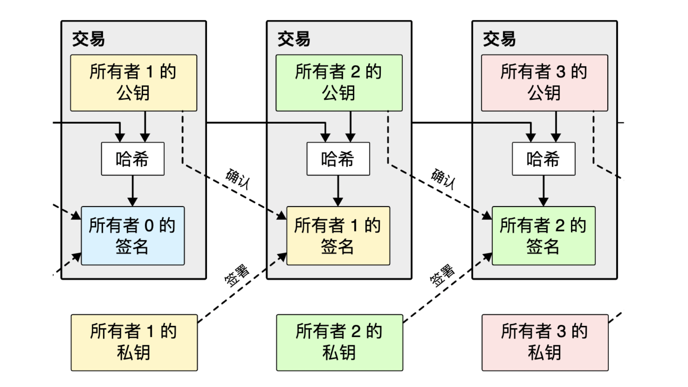
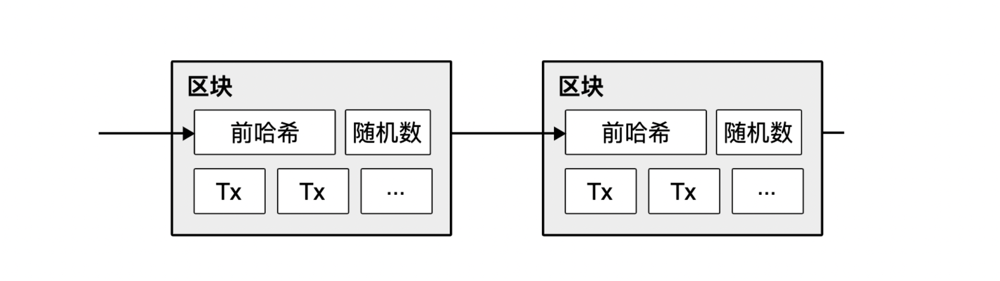

## 比特币：一种点对点的电子现金系统

使用点对点网络去解决双重支出问题。点对点网络将为每笔交易标记时间戳，方法是：把交易的散列数据录入一个不断延展的、以散列为基础的工作证明链上，形成一个如非完全重做就不可能改变的记录。

### 双重支付(double-spending)

双重支付（一币多付、双花攻击）是同一笔数字货币可以被重复花用两次或更多次的情形，是一种数字货币失败模式的构想。任何数字货币都有防止双重支付的措施。

* 受信任的第三方（中心化）
通常由在线受信任的第三方来验证一个数字token是否被花用过。

* 去中心化
在2007年，数个分布式的双重支付防范方法被提出，运用于加密货币与其底层的区块链技术。

### 区块链

We define an electronic coin as a chain of digital signatures.Each owner transfers the coin to the next by digitally signing a hash of the previous transaction and the public key of the next owner and adding these on the end of the coin.

### 工作证明(Proof-Of-Work)

To implement a distributed timestamp server on a peer-to-peer basis,we will need to use a proof-of-work system similar to Adam Back's Hashcash,rather than newspaper or Usenet posts.The proof-of-work involvues scanning for a value that when hashed,such as with SHA-256,the hash begins with a number of zero bits.The average work required is exponential in the number of zero bits required and can be verified by executing a single hash.

### 参考

* > https://github.com/xiaolai/bitcoin-whitepaper-chinese-translation
* > https://zh.wikipedia.org/wiki/%E9%9B%99%E9%87%8D%E6%94%AF%E4%BB%98