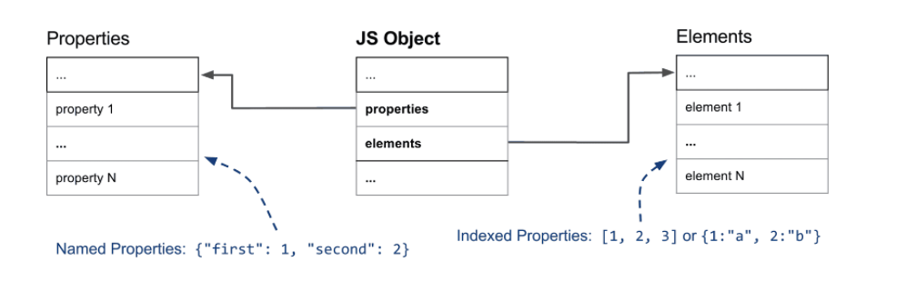
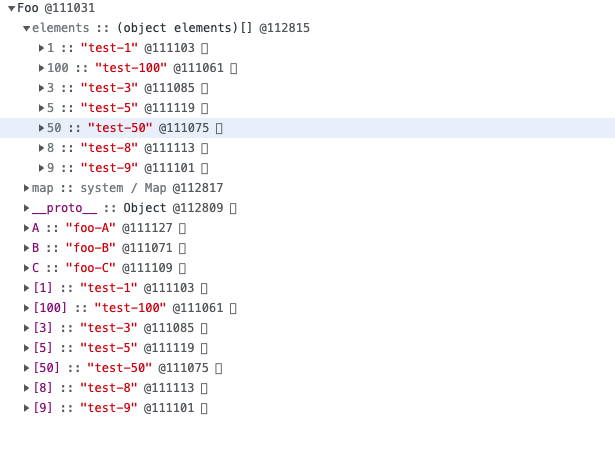
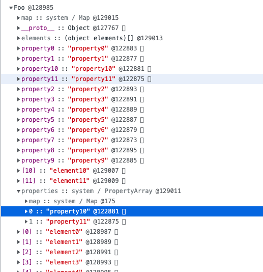
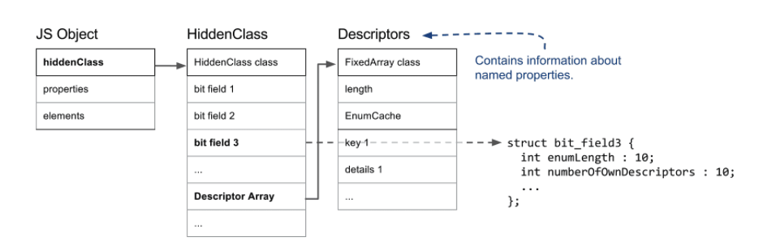
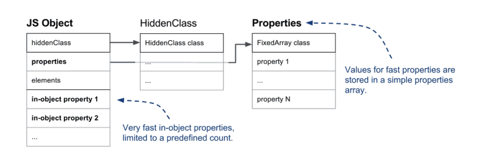
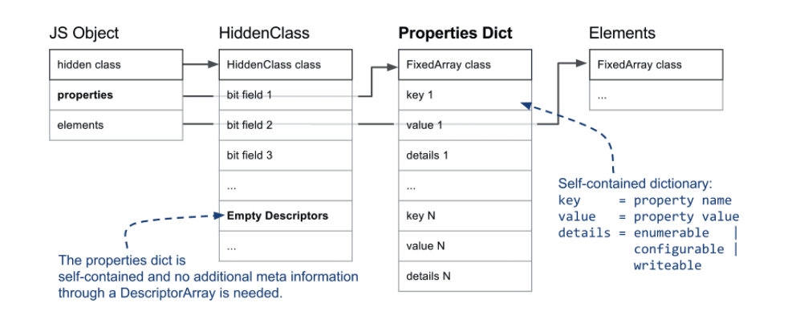
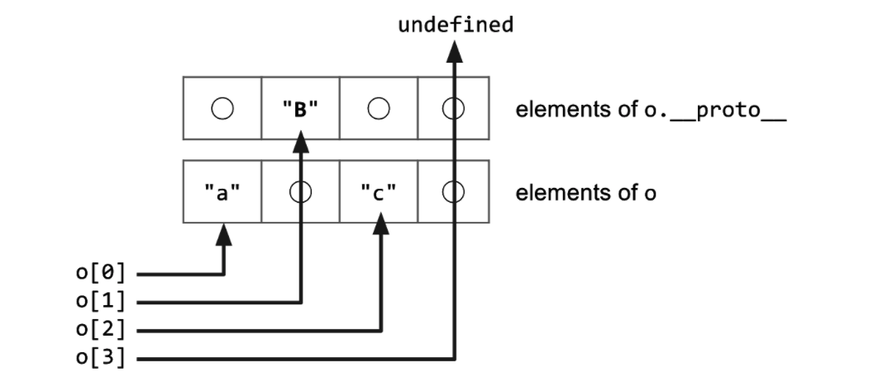
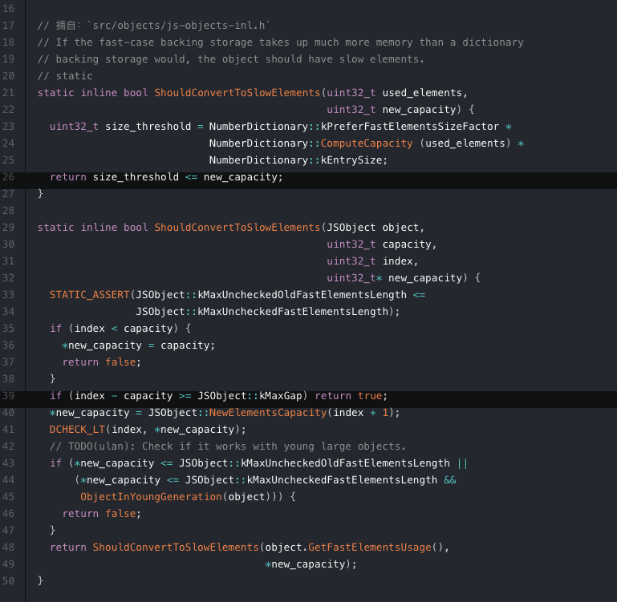
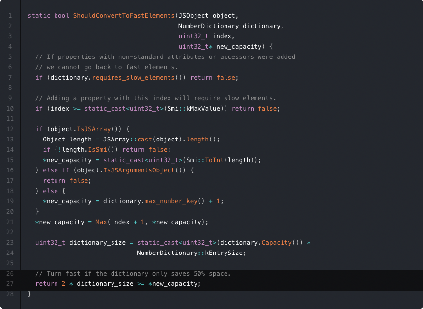

# 数组

* 同种类型，同一个类型元素大小一致
* 连续内存

# 优劣

数组适合读操作多，写操作少的场景

# javascript 数组

js中数组可以是不同的数据类型，也可以是非线性顺序

# v8 中的快慢属性与快慢数组

``` javascript

function Foo(){
  this[100] = 'test-100'
  this[1] = 'test-1'
  this["B"] = 'foo-B'
  this[50] = 'test-50'
  this[9] = 'test-9'
  this[8] = 'test-8'
  this[3] = 'test-3'
  this[5] = 'test-5'
  this["A"] = 'foo-A'
  this["C"] = 'foo-C'
}

const foo = new Foo()
for(const key in foo){
  console.log(`key:${key}, value:${foo[key]}`)
}

// key:1, value:test-1
// key:3, value:test-3
// key:5, value:test-5
// key:8, value:test-8
// key:9, value:test-9
// key:50, value:test-50
// key:100, value:test-100
// key:B, value:foo-B
// key:A, value:foo-A
// key:C, value:foo-C

```

### elements,properties

对于整数形的key值会从小到大遍历，对于非整数型的key值，会按照设置的先后顺序遍历。
在V8中，前后者分别被称为 **数组索引属性（Array-Indexed Properties)** 和 **命名属性（Named Properties)** ,遍历时一般会先遍历前者。前后两者在底层存储在两个单独的数据结构中，分别用 properties 和 elements 两个指针指向它们，如下图：




见下图，没有properties属性，因为V8有一种策略，命名属性少于10个时，命名属性会直接存储到对象本身，而无需先通过properties指针查询，再获取对应的key值。
直接存储到对象本身的属性被称为 对象内属性（In-Object Properties)。




实验
``` javascript
function Foo(propCount,elementCount) {
  for(let i =0;i<elementCount;i++){
    this[i] = `element${i}`
  }
  for(let i=0;i<propCount;i++){
    const prop = `property${i}`
    this[prop] = prop
  }
}

const foo = new Foo(12,12)

```



### 隐藏类和描述符数组

在V8中，每个js对象的第一个字段都指向一个隐藏类。隐藏类是用来描述和便于跟踪JS对象的形状的，里面存储了对象的元信息如：对象的属性数量，对象原型的引用等等。多个具有相同结构（即命名属性和顺序均相同）的对象共享相同的隐藏类。因此，动态地为对象增加属性的过程中隐藏类会被更改。

我们先看看隐藏类的结构：




V8 需要获取命名属性的具体信息时，需要先通过 hiddenClass 指针找到对应的 HiddenClass，获取 HiddenClass 第三位字段中记录的描述符数组指针，然后在数组中查询特定的命名属性.

总结：
* 相同结构（命名属性和顺序均相同）的对象共享相同的hiddenClass
* 新属性的添加伴随着新HiddenClass的创建
* 数组索引性不会改变HiddenClass

### 对象内属性 or 普通属性

超出对象内属性数量限制的属性被存放与 properties 指针指向的数据结构中，这部分虽然增加了一层查询，但扩容非常方便。




### 快属性 or 慢属性

线性数据结构的读取速度更快（读取复杂度为 O(1)），因此将**存储在线性结构中的命名属性称为快属性**。快属性只通过 properties 中的索引访问，但是如前文所述，为了从属性名访问到实际存储位置，V8 必须参考 HiddenClass 上的 Descriptor Array，因为里面存储了关于命名属性的元信息。



因此，**倘若一个对象频繁地增删属性，而 V8 还维持原来的线性结构存储的话，插入和删除的复杂度都为 O(n)**，同时耗费大量的时间、内存在维护 HiddenClass 和 Descriptor Array 上。

为了减少这部分开销，V8 将这些本来会存储在线性结构中的快属性降级为慢属性。此时原本用于存储属性元信息的 Descriptor Array 被置空，转而将信息存储到 properties 内部维护的一个字典（称为 Properties Dictionary）中，这样对对象的增删属性操作便不需更新 **HiddenClass** 了。但这也意味着 V8 内部的**内联缓存**（inline-cache）不会生效，所以这种属性被称为慢属性。


### 数组

# 全填充 or 带孔

``` javascript
const o = ['a', 'b', 'c']
console.log(o[1])          // 'b'.

delete o[1]
console.log(o[1])          // undefined
o.__proto__ = { 1: 'B' }
console.log(o[0])          // 'a'.
console.log(o[1])          // 'B'. 但如何确定要访问原型链？
console.log(o[2])          // 'c'.
console.log(o[3])          // undefined
```
如果一个数组中所有位置均有值，我们称之为**全填充Packed数组**，若某些位置在初始化时未定义（如 const arr = [1, , 3] 中的 arr[1]），或定义后被删除（delete，如上述例子），称之为**带孔（Holey）数组**。



### 快数组 or 慢数组

```javascript
const arr = [1, 2, 3]
arr[1999] = 1999
```
这个例子中，在行 1 声明完毕后 arr 是一个全填充的数组，但在行 2 马上又定义索引 1999 处值为 1999，此时如果为 arr 创建一个长度为 2000 的完整数组来存储这样的稀疏数据将会非常占用内存，为了应对这种情况，V8 会将数组降级为慢数组，创建一个字典来存储「键、值、描述符」（key、value、descriptor） 三元组。这就是 Object.defineProperty(object, key, descriptor) API 同样会做的事情。

```javascript

Object.defineProperty(arr,1999,{value:'1999',configurable:false})

```

鉴于我们没有办法在 JavaScript 的 API 层面让 V8 找到 HiddenClass 并存储对应的 descriptor 信息，所以当使用 Object.defineProperty 自定义 key、value、descriptor 时，V8 都会使用慢属性，对应到数组中就是慢数组。


## why 为什么js中数组可以存储不同类型的值

数组继承js对象，是一种特殊的对象


* 快模式：数组实现的是 V8 里一个叫 FixedArray 的类，它在内存中是连续的空间，直接通过索引读写值，非常快。如果有 push 或 pop 操作，它会动态地扩容或收缩。
* 慢模式：如前文所介绍，V8 创建了一个字典（HashTable）来记录映射关系，其中索引的整数值即是字典的键。
  
### 快数组何时转换为慢数组：



* 如果快数组扩容后的容量是原来的 3 倍以上，意味着它比 HashTable 形式存储占用更大的内存，快数组会转换为慢数组
* 如果快数组新增的索引与原来最大索引的差值大于 1024，快数组会被转换会慢数组

### 慢数组何时转化为快速组



* 当转化为快数组能节省不小于50%的空间时


## 参考
* [快慢属性-快慢数组]https://z3rog.tech/blog/2020/fast-properties.html#%E5%AF%B9%E8%B1%A1%E5%86%85%E5%B1%9E%E6%80%A7-or-%E6%99%AE%E9%80%9A%E5%B1%9E%E6%80%A7
* [hidden-class] https://engineering.linecorp.com/en/blog/v8-hidden-class/
* [inline-cache]https://github.com/sq/JSIL/wiki/Optimizing-dynamic-JavaScript-with-inline-caches
* [Fast properties] https://v8.dev/blog/fast-properties

