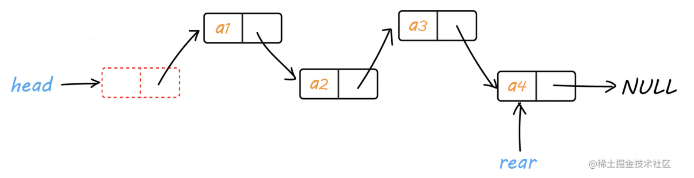
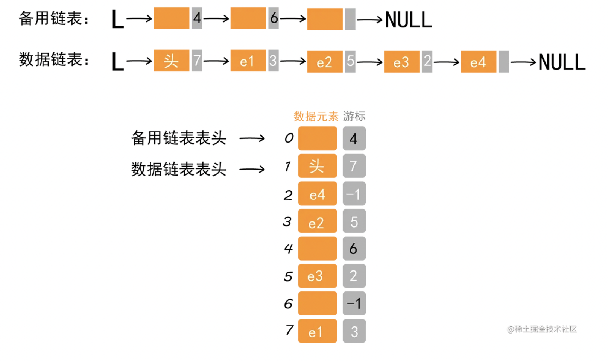

# 链表

* 链表是一种线性表，采用链式存储的方式有序的存储有限个数量的元素
* 链表中每一个节点中存储了到下一个节点的指针

# 线性表

* 一对一，有限，相同特征

数组和链表就是非常经典的线性表。

线性表有两个存储方式，分别是顺序存储和链式存储。

链表按存储方式来分也分为 静态链表 和 动态链表，其中 静态链表 使用 顺序存储，动态链表 使用 链式存储

头指针：头指针是指链表指向的第一个结点的指针，若链表有头结点，则是指向头结点的指针，头指针须具有标识作用，所以常用头指针冠以链表的名字，无论链表是否为空，头指针均不为空，头指针是链表的必要元素

头结点（head）：头结点时为了操作的同意和方便而设立的，放在第一元素的头结点之前，其数据域一般无真实意义5

尾指针（rear）：与头指针类似，不过是链表中的最后一个节点的指针

# 静态单链表

静态链表是用类似于数组方法实现的，是顺序的存储结构，在物理地址上是连续的，而且需要预先分配地址空间大小。所以静态链表的初始长度一般是固定的，在做插入和删除操作时不需要移动元素，仅需修改指针。

# 备用链表

备用链表的作用是回收数组中未使用或之前使用过（目前未使用）的存储空间，留待后期使用。也就是说，静态链表使用数组申请的物理空间中，存有两个链表，一条连接数据，另一条连接数组中未使用的空间。

# 优点

* 插入和删除速度快，保留原有的物理顺序，在插入或者删除一个元素的时候，只需要改变指针指向即可。

* 没有空间限制,存储元素无上限,只与内存空间大小有关.

* 动态分配内存空间，不用事先开辟内存

* 使内存的利用率变高

# 缺点

* 占用额外的空间以存储指针，比较浪费空间，不连续存储，开辟空间碎片比较多
  
* 查找速度比较慢，因为在查找时，需要循环遍历链表。

# 总结
时间复杂度 : 查找操作为O(n) ,插入和删除操作为O(1)。

