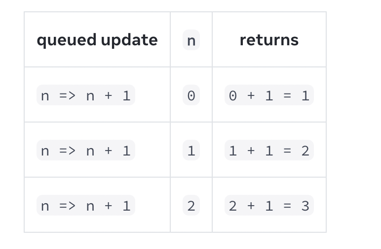

## State as a Snapshot


### How does React know which state to return 

Internally, React holds an array of state pairs for every component. It also maintains the current pair index, which is set to 0 before rendering. Each time you call useState, React gives you the next state pair and increments the index.You can read more about this mechanism in React Hooks: Not Magic, Just Arrays.


``` javascript

let componentHooks = [];
let currentHookIndex =0 ;

function useState(initialState){
    let pair = componentHooks[currentHookIndex];
    if(pair){
        
        currentHookIndex++
        return pair
    }
    function setState(nextState){
        pair[0]=nextState;
        // rerender()
    }
    pair = [initialState,setState];

    componentHooks[currentHookIndex] = pair;
    currentHookIndex++

    return pair
}


```

### Setting state only changes it for the next render. 


+1

``` javascript

import { useState } from 'react';

export default function Counter() {
  const [number, setNumber] = useState(0);

  return (
    <>
      <h1>{number}</h1>
      <button onClick={() => {
        setNumber(number + 1);
        setNumber(number + 1);
        setNumber(number + 1);
      }}>+3</button>
    </>
  )
}


```

### A state variable’s value never changes within a render

even if its event handler’s code is asynchronous. Inside that render’s onClick, the value of number continues to be 0 even after setNumber(number + 5) was called. Its value was “fixed” when React “took the snapshot” of the UI by calling your component.


0
``` javascript 
import { useState } from 'react';

export default function Counter() {
  const [number, setNumber] = useState(0);

  return (
    <>
      <h1>{number}</h1>
      <button onClick={() => {
        setNumber(number + 5);
        setTimeout(() => {
          alert(number);
        }, 3000);
      }}>+5</button>
    </>
  )
}
```

**React keeps the state values “fixed” within one render’s event handlers. You don’t need to worry whether the state has changed while the code is running.**


### Updating the same state multiple times before the next render

Instead of passing the next state value like **setNumber(number + 1)**,you can pass a function that calculates the next state based on the previous one in the queue,like **setNumber(n=>n+1)**




### Update object in state

Although objects in React state are technically mutable,you should treat them as if they were immutable-like numbers,booleans, and strings. 
Instead of mutating them,you should always replace them.

To actually trigger a re-render in this case,create a new object and pass it to the state setting function:

``` javascript 

onPointerMove={e => {
  setPosition({
    x: e.clientX,
    y: e.clientY
  });
}}

```

### Copying objects with the spread syntax

``` javascript

setPerson({
  ...person, // Copy the old fields
  firstName: e.target.value // But override this one
});


```

### Update nested object using immer 

``` javascript

import { useImmer } from 'use-immer';

export default function Form() {
  const [person, updatePerson] = useImmer({
    name: 'Niki de Saint Phalle',
    artwork: {
      title: 'Blue Nana',
      city: 'Hamburg',
      image: 'https://i.imgur.com/Sd1AgUOm.jpg',
    }
  });

  function handleNameChange(e) {
    updatePerson(draft => {
      draft.name = e.target.value;
    });
  }

  function handleTitleChange(e) {
    updatePerson(draft => {
      draft.artwork.title = e.target.value;
    });
  }

  function handleCityChange(e) {
    updatePerson(draft => {
      draft.artwork.city = e.target.value;
    });
  }

  function handleImageChange(e) {
    updatePerson(draft => {
      draft.artwork.image = e.target.value;
    });
  }

  return (
    <>
      <label>
        Name:
        <input
          value={person.name}
          onChange={handleNameChange}
        />
      </label>
      <label>
        Title:
        <input
          value={person.artwork.title}
          onChange={handleTitleChange}
        />
      </label>
      <label>
        City:
        <input
          value={person.artwork.city}
          onChange={handleCityChange}
        />
      </label>
      <label>
        Image:
        <input
          value={person.artwork.image}
          onChange={handleImageChange}
        />
      </label>
      <p>
        <i>{person.artwork.title}</i>
        {' by '}
        {person.name}
        <br />
        (located in {person.artwork.city})
      </p>
      
    </>
  );
}

```

### Why is mutating state not recommended in React ?

* Debugging console.log
* Optimizations (prevObj === obj)

  


### 参考
* > https://react.dev/learn/state-a-components-memory
* > https://medium.com/@ryardley/react-hooks-not-magic-just-arrays-cd4f1857236e
* > https://react.dev/learn/queueing-a-series-of-state-updates
* > https://react.dev/learn/updating-objects-in-state
* > https://react.dev/learn/updating-arrays-in-state