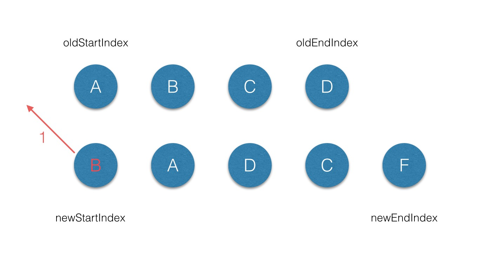

### 初始化渲染

new Vue()->init()->mount()->compile()->render()->vnode->patch->dom


### 生命周期


 *  **beforeCreate 和 beforeCreated**

new Vue()->initLifecycle and Events->beforeCreate->initState->created

  ``` javascript
  Vue.prototype._init = function(options?:Object) {
    // ...
    initLifecycle(vm)
    initEvents(vm)
    initRender(vm)
    callHook(vm, 'beforeCreate')
    initInjections(vm) // resolve injections before data/props
    initState(vm)
    initProvide(vm) // resolve provide after data/props
    callHook(vm, 'created')

    // ...
  }

  ```

 * **beforeMount && mounted**

beforeMount -> render()->vnode->patch-dom->mounted

``` javascript
export function mountComponent (
  vm: Component,
  el: ?Element,
  hydrating?: boolean
): Component {
  vm.$el = el
  // ...
  callHook(vm, 'beforeMount')

  let updateComponent
  /* istanbul ignore if */
  if (process.env.NODE_ENV !== 'production' && config.performance && mark) {
    updateComponent = () => {
      const name = vm._name
      const id = vm._uid
      const startTag = `vue-perf-start:${id}`
      const endTag = `vue-perf-end:${id}`

      mark(startTag)
      const vnode = vm._render()
      mark(endTag)
      measure(`vue ${name} render`, startTag, endTag)

      mark(startTag)
      vm._update(vnode, hydrating)
      mark(endTag)
      measure(`vue ${name} patch`, startTag, endTag)
    }
  } else {
    updateComponent = () => {
      vm._update(vm._render(), hydrating)
    }
  }

  // we set this to vm._watcher inside the watcher's constructor
  // since the watcher's initial patch may call $forceUpdate (e.g. inside child
  // component's mounted hook), which relies on vm._watcher being already defined
  new Watcher(vm, updateComponent, noop, {
    before () {
      if (vm._isMounted) {
        callHook(vm, 'beforeUpdate')
      }
    }
  }, true /* isRenderWatcher */)
  hydrating = false

  // manually mounted instance, call mounted on self
  // mounted is called for render-created child components in its inserted hook
  if (vm.$vnode == null) {
    vm._isMounted = true
    callHook(vm, 'mounted')
  }
  return vm
}

```

* **beforeUpdate & updated**
data updated->beforeUpdate->udpated 

``` javascript 
export function mountComponent (
  vm: Component,
  el: ?Element,
  hydrating?: boolean
): Component {
  // ...
  // 这里是简写
  let updateComponent = () => {
      vm._update(vm._render(), hydrating)
  }
  new Watcher(vm, updateComponent, noop, {
    before () {
      if (vm._isMounted) {
        callHook(vm, 'beforeUpdate')
      }
    }
  }, true /* isRenderWatcher */)
  // ...
}
```


``` javascript

function flushSchedulerQueue () {
  // ...
  // 获取到 updatedQueue
  callUpdatedHooks(updatedQueue)
}

function callUpdatedHooks (queue) {
  let i = queue.length
  while (i--) {
    const watcher = queue[i]
    const vm = watcher.vm
    if (vm._watcher === watcher && vm._isMounted) {
      callHook(vm, 'updated')
    }
  }
}

```

* **beforeDestory & destoryed**

``` javascript

Vue.prototype.$destroy = function () {
    const vm: Component = this
    if (vm._isBeingDestroyed) {
      return
    }
    callHook(vm, 'beforeDestroy')
    vm._isBeingDestroyed = true
    // remove self from parent
    const parent = vm.$parent
    if (parent && !parent._isBeingDestroyed && !vm.$options.abstract) {
      remove(parent.$children, vm)
    }
    // teardown watchers
    if (vm._watcher) {
      vm._watcher.teardown()
    }
    let i = vm._watchers.length
    while (i--) {
      vm._watchers[i].teardown()
    }
    // remove reference from data ob
    // frozen object may not have observer.
    if (vm._data.__ob__) {
      vm._data.__ob__.vmCount--
    }
    // call the last hook...
    vm._isDestroyed = true
    // invoke destroy hooks on current rendered tree
    vm.__patch__(vm._vnode, null)
    // fire destroyed hook
    callHook(vm, 'destroyed')
    // turn off all instance listeners.
    vm.$off()
    // remove __vue__ reference
    if (vm.$el) {
      vm.$el.__vue__ = null
    }
    // release circular reference (#6759)
    if (vm.$vnode) {
      vm.$vnode.parent = null
    }
  }


```


* **activated & deactivated**
keep-alive

加载渲染过程

```
父beforeCreate->父created->父beforeMount->子beforeCreate->子created->子beforeMount->子mounted->父mounted
```

更新过程

```
父beforeUpdate->子beforeUpdate->子updated->父updated
```

销毁过程

```
父beforeDestroy->子beforeDestroy->子destroyed->父destroyed

```


### 响应式原理

```

1. 我需要修改哪块的 DOM？

2. 我的修改效率和性能是不是最优的？

3. 我需要对数据每一次的修改都去操作 DOM 吗？

4. 我需要 case by case 去写修改 DOM 的逻辑吗？

```

``` javascript 

Object.defineProperty(obj,prop,descriptor)

```

#### 响应式对象

Observer 是一个类，它的作用是给对象的属性添加 getter 和 setter，用于依赖收集和派发更新。

**依赖收集**

```javascript

export function defineReactive (
  obj: Object,
  key: string,
  val: any,
  customSetter?: ?Function,
  shallow?: boolean
) {
  const dep = new Dep()

  const property = Object.getOwnPropertyDescriptor(obj, key)
  if (property && property.configurable === false) {
    return
  }

  // cater for pre-defined getter/setters
  const getter = property && property.get
  const setter = property && property.set
  if ((!getter || setter) && arguments.length === 2) {
    val = obj[key]
  }

  let childOb = !shallow && observe(val)
  Object.defineProperty(obj, key, {
    enumerable: true,
    configurable: true,
    get: function reactiveGetter () {
      const value = getter ? getter.call(obj) : val
      if (Dep.target) {
        dep.depend()
        if (childOb) {
          childOb.dep.depend()
          if (Array.isArray(value)) {
            dependArray(value)
          }
        }
      }
      return value
    },
    // ...
  })
}


```

**Dep**

``` javascript

import type Watcher from './watcher'
import { remove } from '../util/index'

let uid = 0

/**
 * A dep is an observable that can have multiple
 * directives subscribing to it.
 */
export default class Dep {
  static target: ?Watcher;
  id: number;
  subs: Array<Watcher>;

  constructor () {
    this.id = uid++
    this.subs = []
  }

  addSub (sub: Watcher) {
    this.subs.push(sub)
  }

  removeSub (sub: Watcher) {
    remove(this.subs, sub)
  }

  depend () {
    if (Dep.target) {
      Dep.target.addDep(this)
    }
  }

  notify () {
    // stabilize the subscriber list first
    const subs = this.subs.slice()
    for (let i = 0, l = subs.length; i < l; i++) {
      subs[i].update()
    }
  }
}

// the current target watcher being evaluated.
// this is globally unique because there could be only one
// watcher being evaluated at any time.
Dep.target = null
const targetStack = []

export function pushTarget (_target: ?Watcher) {
  if (Dep.target) targetStack.push(Dep.target)
  Dep.target = _target
}

export function popTarget () {
  Dep.target = targetStack.pop()
}

```
Dep 实际上就是对Watcher的一种管理


Watcher

```javascript

export default class Watcher {
  dep:Dep;
  deps:Array<Dep>;
  newDeps:Array<Dep>;
  depIds:SimpleSet;
  newDepIds:SimpleSet;

   constructor (
    vm: Component,
    expOrFn: string | Function,
    cb: Function,
    options?: ?Object,
    isRenderWatcher?: boolean
  ) {
    this.vm = vm
    if (isRenderWatcher) {
      vm._watcher = this
    }
    vm._watchers.push(this)
    // options
    if (options) {
      this.deep = !!options.deep
      this.user = !!options.user
      this.computed = !!options.computed
      this.sync = !!options.sync
      this.before = options.before
    } else {
      this.deep = this.user = this.computed = this.sync = false
    }
    this.cb = cb
    this.id = ++uid // uid for batching
    this.active = true
    this.dirty = this.computed // for computed watchers
    this.deps = []
    this.newDeps = []
    this.depIds = new Set()
    this.newDepIds = new Set()
    this.expression = process.env.NODE_ENV !== 'production'
      ? expOrFn.toString()
      : ''
    // parse expression for getter
    if (typeof expOrFn === 'function') {
      this.getter = expOrFn
    } else {
      this.getter = parsePath(expOrFn)
      if (!this.getter) {
        this.getter = function () {}
        process.env.NODE_ENV !== 'production' && warn(
          `Failed watching path: "${expOrFn}" ` +
          'Watcher only accepts simple dot-delimited paths. ' +
          'For full control, use a function instead.',
          vm
        )
      }
    }
    if (this.computed) {
      this.value = undefined
      this.dep = new Dep()
    } else {
      this.value = this.get()
    }
  }

  get () {
    pushTarget(this)
    let value
    const vm = this.vm
    try {
      value = this.getter.call(vm, vm)
    } catch (e) {
      if (this.user) {
        handleError(e, vm, `getter for watcher "${this.expression}"`)
      } else {
        throw e
      }
    } finally {
      // "touch" every property so they are all tracked as
      // dependencies for deep watching
      if (this.deep) {
        traverse(value)
      }
      popTarget()
      this.cleanupDeps()
    }
    return value
  }
    
  addDep(dep:Dep) {
    const id = dep.id
    if (!this.newDepIds.has(id)) {
      this.newDepIds.add(id)
      this.newDeps.push(dep)
      if (!this.depIds.has(id)) {
        dep.addSub(this)
      }
    }
  }

  cleanupDeps () {
    let i = this.deps.length
    while (i--) {
      const dep = this.deps[i]
      if (!this.newDepIds.has(dep.id)) {
        dep.removeSub(this)
      }
    }
    let tmp = this.depIds
    this.depIds = this.newDepIds
    this.newDepIds = tmp
    this.newDepIds.clear()
    tmp = this.deps
    this.deps = this.newDeps
    this.newDeps = tmp
    this.newDeps.length = 0
  }
}

```

**渲染Watcher**

```javascript 
updateComponent = () => {
  vm._update(vm._render(), hydrating)
}
new Watcher(vm, updateComponent, noop, {
  before () {
    if (vm._isMounted) {
      callHook(vm, 'beforeUpdate')
    }
  }
}, true /* isRenderWatcher */)

```

#### 总结

收集依赖的目的是为了当这些响应式数据发生变化，触发它们的 setter 的时候，能知道应该通知哪些订阅者去做相应的逻辑处理，我们把这个过程叫派发更新，其实 Watcher 和 Dep 就是一个非常经典的观察者设计模式的实现。


### 派发更新


``` javascript

/**
 * Define a reactive property on an Object.
 */
export function defineReactive (
  obj: Object,
  key: string,
  val: any,
  customSetter?: ?Function,
  shallow?: boolean
) {
  const dep = new Dep()

  const property = Object.getOwnPropertyDescriptor(obj, key)
  if (property && property.configurable === false) {
    return
  }

  // cater for pre-defined getter/setters
  const getter = property && property.get
  const setter = property && property.set
  if ((!getter || setter) && arguments.length === 2) {
    val = obj[key]
  }

  let childOb = !shallow && observe(val)
  Object.defineProperty(obj, key, {
    enumerable: true,
    configurable: true,
    // ...
    set: function reactiveSetter (newVal) {
      const value = getter ? getter.call(obj) : val
      /* eslint-disable no-self-compare */
      if (newVal === value || (newVal !== newVal && value !== value)) {
        return
      }
      /* eslint-enable no-self-compare */
      if (process.env.NODE_ENV !== 'production' && customSetter) {
        customSetter()
      }
      if (setter) {
        setter.call(obj, newVal)
      } else {
        val = newVal
      }
      childOb = !shallow && observe(newVal)
      dep.notify()
    }
  })
}
```

```javascript
class Dep {
  // ...
  notify () {
  // stabilize the subscriber list first
    const subs = this.subs.slice()
    for (let i = 0, l = subs.length; i < l; i++) {
      subs[i].update()
    }
  }
}

class Watcher {
  // ...
  update () {
    /* istanbul ignore else */
    if (this.computed) {
      // A computed property watcher has two modes: lazy and activated.
      // It initializes as lazy by default, and only becomes activated when
      // it is depended on by at least one subscriber, which is typically
      // another computed property or a component's render function.
      if (this.dep.subs.length === 0) {
        // In lazy mode, we don't want to perform computations until necessary,
        // so we simply mark the watcher as dirty. The actual computation is
        // performed just-in-time in this.evaluate() when the computed property
        // is accessed.
        this.dirty = true
      } else {
        // In activated mode, we want to proactively perform the computation
        // but only notify our subscribers when the value has indeed changed.
        this.getAndInvoke(() => {
          this.dep.notify()
        })
      }
    } else if (this.sync) {
      this.run()
    } else {
      queueWatcher(this)
    }
  }

  /**
   * Scheduler job interface.
   * Will be called by the scheduler.
   */
  run () {
    if (this.active) {
      this.getAndInvoke(this.cb)
    }
  }

  getAndInvoke (cb: Function) {
    const value = this.get()
    if (
      value !== this.value ||
      // Deep watchers and watchers on Object/Arrays should fire even
      // when the value is the same, because the value may
      // have mutated.
      isObject(value) ||
      this.deep
    ) {
      // set new value
      const oldValue = this.value
      this.value = value
      this.dirty = false
      if (this.user) {
        try {
          cb.call(this.vm, value, oldValue)
        } catch (e) {
          handleError(e, this.vm, `callback for watcher "${this.expression}"`)
        }
      } else {
        cb.call(this.vm, value, oldValue)
      }
    }
  }

}  
```
对于渲染watcher而言，执行this.get()方法求值的时候，会执行getter 方法：

```
updateComponent = () => {
  vm._update(vm._render(), hydrating)
}

```
这就是当我们去修改组件相关的响应式数据的时候，会触发组件重新渲染的原因。

#### 总结

setter=>wather=>update=>nextTick

我们对 Vue 数据修改派发更新的过程也有了认识，实际上就是当数据发生变化的时候，触发 setter 逻辑，把在依赖过程中订阅的的所有观察者，也就是 watcher，都触发它们的 update 过程，这个过程又利用了队列做了进一步优化，在 nextTick 后执行所有 watcher 的 run，最后执行它们的回调函数。

### nextTick

**事件队列**
``` javascript
for (macroTask of macroTaskQueue) {
    // 1. Handle current MACRO-TASK
    handleMacroTask();
      
    // 2. Handle all MICRO-TASK
    for (microTask of microTaskQueue) {
        handleMicroTask(microTask);
    }
}
```
在浏览器环境中，常见的 macro task 有 setTimeout、MessageChannel、postMessage、setImmediate；常见的 micro task 有 MutationObsever 和 Promise.then

我们在有之前的知识背景，再理解 nextTick 的实现就不难了，这里有一段很关键的注释：在 Vue 2.4 之前的版本，nextTick 几乎都是基于 micro task 实现的，但由于 micro task 的执行优先级非常高，在某些场景下它甚至要比事件冒泡还要快，就会导致一些诡异的问题，如 issue #4521、#6690、#6566；但是如果全部都改成 macro task，对一些有重绘和动画的场景也会有性能影响，如 issue #6813。所以最终 nextTick 采取的策略是默认走 micro task，对于一些 DOM 交互事件，如 v-on 绑定的事件回调函数的处理，会强制走 macro task。

这个强制是怎么做的呢，原来在 Vue.js 在绑定 DOM 事件的时候，默认会给回调的 handler 函数调用 withMacroTask 方法做一层包装，它保证整个回调函数执行过程中，遇到数据状态的改变，这些改变都会被推到 macro task 中。

对于 macro task 的执行，Vue.js 优先检测是否支持原生 setImmediate，这是一个高版本 IE 和 Edge 才支持的特性，不支持的话再去检测是否支持原生的 MessageChannel，如果也不支持的话就会降级为 setTimeout 0。


``` javascript 

import { noop } from 'shared/util'
import { handleError } from './error'
import { isIOS, isNative } from './env'

const callbacks = []
let pending = false

function flushCallbacks () {
  pending = false
  const copies = callbacks.slice(0)
  callbacks.length = 0
  for (let i = 0; i < copies.length; i++) {
    copies[i]()
  }
}

// Here we have async deferring wrappers using both microtasks and (macro) tasks.
// In < 2.4 we used microtasks everywhere, but there are some scenarios where
// microtasks have too high a priority and fire in between supposedly
// sequential events (e.g. #4521, #6690) or even between bubbling of the same
// event (#6566). However, using (macro) tasks everywhere also has subtle problems
// when state is changed right before repaint (e.g. #6813, out-in transitions).
// Here we use microtask by default, but expose a way to force (macro) task when
// needed (e.g. in event handlers attached by v-on).
let microTimerFunc
let macroTimerFunc
let useMacroTask = false

// Determine (macro) task defer implementation.
// Technically setImmediate should be the ideal choice, but it's only available
// in IE. The only polyfill that consistently queues the callback after all DOM
// events triggered in the same loop is by using MessageChannel.
/* istanbul ignore if */
if (typeof setImmediate !== 'undefined' && isNative(setImmediate)) {
  macroTimerFunc = () => {
    setImmediate(flushCallbacks)
  }
} else if (typeof MessageChannel !== 'undefined' && (
  isNative(MessageChannel) ||
  // PhantomJS
  MessageChannel.toString() === '[object MessageChannelConstructor]'
)) {
  const channel = new MessageChannel()
  const port = channel.port2
  channel.port1.onmessage = flushCallbacks
  macroTimerFunc = () => {
    port.postMessage(1)
  }
} else {
  /* istanbul ignore next */
  macroTimerFunc = () => {
    setTimeout(flushCallbacks, 0)
  }
}

// Determine microtask defer implementation.
/* istanbul ignore next, $flow-disable-line */
if (typeof Promise !== 'undefined' && isNative(Promise)) {
  const p = Promise.resolve()
  microTimerFunc = () => {
    p.then(flushCallbacks)
    // in problematic UIWebViews, Promise.then doesn't completely break, but
    // it can get stuck in a weird state where callbacks are pushed into the
    // microtask queue but the queue isn't being flushed, until the browser
    // needs to do some other work, e.g. handle a timer. Therefore we can
    // "force" the microtask queue to be flushed by adding an empty timer.
    if (isIOS) setTimeout(noop)
  }
} else {
  // fallback to macro
  microTimerFunc = macroTimerFunc
}

/**
 * Wrap a function so that if any code inside triggers state change,
 * the changes are queued using a (macro) task instead of a microtask.
 */
export function withMacroTask (fn: Function): Function {
  return fn._withTask || (fn._withTask = function () {
    useMacroTask = true
    const res = fn.apply(null, arguments)
    useMacroTask = false
    return res
  })
}

export function nextTick (cb?: Function, ctx?: Object) {
  let _resolve
  callbacks.push(() => {
    if (cb) {
      try {
        cb.call(ctx)
      } catch (e) {
        handleError(e, ctx, 'nextTick')
      }
    } else if (_resolve) {
      _resolve(ctx)
    }
  })
  if (!pending) {
    pending = true
    if (useMacroTask) {
      macroTimerFunc()
    } else {
      microTimerFunc()
    }
  }
  // $flow-disable-line
  if (!cb && typeof Promise !== 'undefined') {
    return new Promise(resolve => {
      _resolve = resolve
    })
  }
}

```

### 检测变化的注意事项

* 对象添加属性 -> $set
* 数组-> 重写[push,pop,splice,sort,shift]数组方法


### 计算属性VS侦听属性

#### 计算属性

```
initComputed=>new ComputedWatcher=> defineReactive({getter:()=>{ watcher.depend();watcher.evaluate();})

```
我们知道计算属性本质上就是一个 computed watcher，也了解了它的创建过程和被访问触发 getter 以及依赖更新的过程，其实这是最新的计算属性的实现，之所以这么设计是因为 Vue 想确保不仅仅是计算属性依赖的值发生变化，而是当计算属性最终计算的值发生变化才会触发渲染 watcher 重新渲染，本质上是一种优化。


#### 侦听属性

```
initWatcher=>User Watcher
```
侦听属性 =》User Watcher


### diff 算法




### 总结 


### 参考
* [github] https://github.com/DDFE/DDFE-blog/issues/24
* [book] https://ustbhuangyi.github.io/vue-analysis/v2/reactive/next-tick.html#vue-%E7%9A%84%E5%AE%9E%E7%8E%B0
* [github] https://github.com/DDFE/DDFE-blog/issues/18


