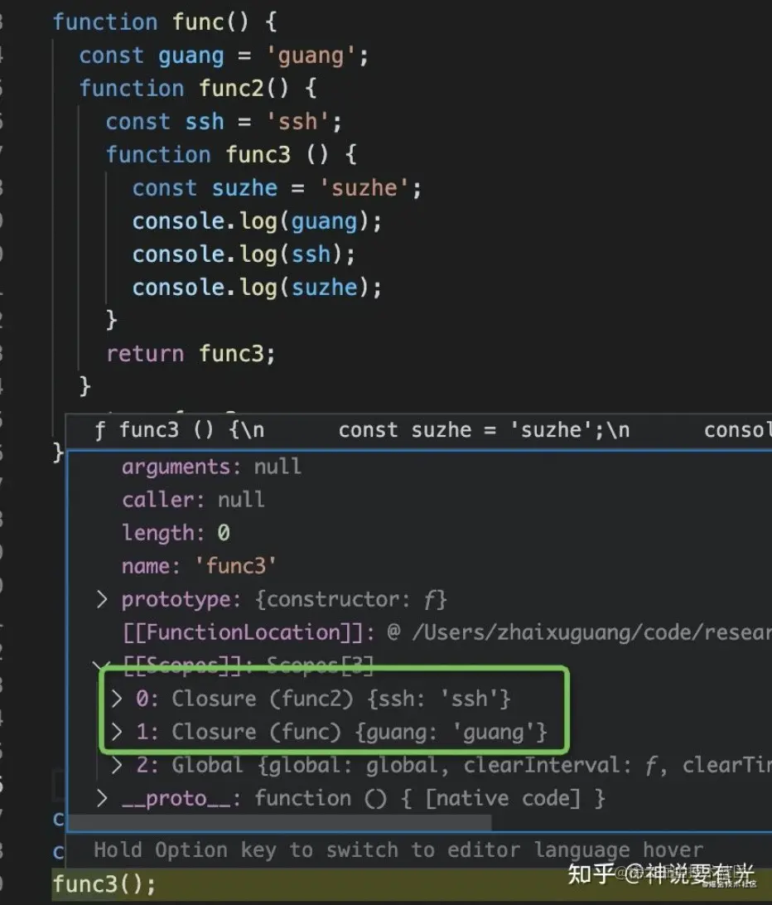

### 闭包

闭包是指有权访问另一个函数作用域中的变量的函数

``` javascript
function getName() {
    const name = 'outer1';
    function displayName() {
        console.log(name)
    }
    return displayName
}
const display = getName()
display()
```

### 作用域

* 全局作用域
* 函数作用域
* 块级作用域


### 作用域链

``` javascript 

"use strict";
function createCounter(initial) {
  var counter = initial;
  
  function increment(value) {
    counter += value;
  }
  
  function get() {
    return counter;
  }
  
  return {
    increment: increment,
    get: get
  };
}

var myCounter = createCounter(100);
console.log(myCounter.get());   // 返回 100

myCounter.increment(5);
console.log(myCounter.get());   // 返回 105

```


### 内存管理

``` javascript 

function func () {
  const a = 1;
  return function () {
    console.log(a);
  }
}
const f2 = func();

```

func 调用结束要不要销魂作用域 ？

销毁父作用域后，把用到的变量包起来，打包给子函数，放到一个属性上 [[scope]]

  


### 作用

JavaScript 是静态作用域的设计，闭包是为了解决子函数晚于父函数销毁的问题，我们会在父函数销毁时，把子函数引用到的变量打成 Closure 包放到函数的 [[Scopes]] 上，让它计算父函数销毁了也随时随地能访问外部环境。

  
### 缺点


### 参考文献
* [github] https://github.com/dwqs/blog/issues/18
* [掘金]https://juejin.cn/post/6953594159768797214
* [公众号] https://mp.weixin.qq.com/s?__biz=MzA4Nzg0MDM5Nw==&mid=2247484662&idx=1&sn=bf83b91a5d527395b20620d254ded452&source=41#wechat_redirect
* [木易] https://muyiy.cn/blog/2/2.2.html#%E5%88%86%E6%9E%90
* [掘金] https://juejin.cn/post/6957913856488243237
  
