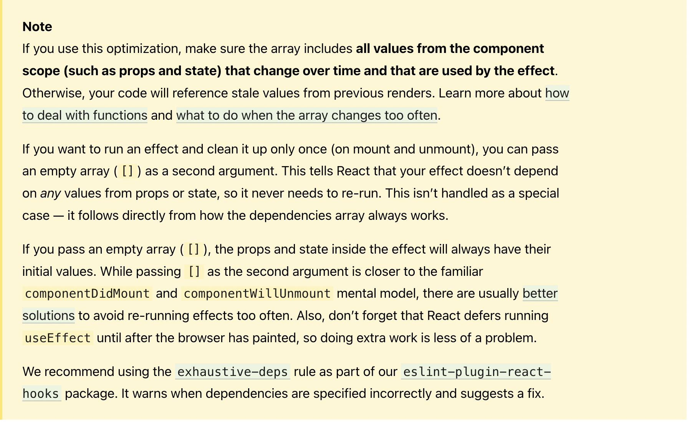

## Hooks

* Hooks allow you to reuse stateful logic without changing your component hierarchy.
  
* Hooks let you split one component into smaller functions based on what pieces are related(such as setting up a subscription or fetching data).

* Hooks let you use more of React's features without classes.


### what is a Hook

A Hook is a special function that lets you "hook into" React features.For example,useState is a Hook that lets you add React state to function components. 

### when would I use a Hook

If you write a function component and realize you need to add some state to it.


### useState

``` javascript

import {useState} from 'react'

const [count,setCount] = useState(0);

```

#### What does calling useState do ?

It declares a "state variable". Our variable is called count but we could call it anything else, like banana. This is a way to “preserve” some values between the function calls — useState is a new way to use the exact same capabilities that this.state provides in a class. Normally, variables “disappear” when the function exits but state variables are preserved by React.

#### What do we pass to useState as an argument
The only argument to the useState() Hook is the initial state.

#### What does useState return?
 It returns a pair of values: the current state and a function that updates it. 


### useEffect

Data fetching,setting up a subscription, and manually changing the DOM in React components are all examples of side effects.

#### What does useEffect do ?

By using this Hook, you tell React that your component needs to do something after render. 

#### Why is useEffect called inside a component? 

Placing useEffect inside the component lets us access the count state variable (or any props) right from the effect. 


#### Does useEffect run after every render? 

Yes! By default, it runs both after the first render and after every update.


#### Why did we return a function from our effect?

This is the optional cleanup mechanism for effects. Every effect may return a function that cleans up after it. 

#### When exactly does React clean up an effect? 

React performs the cleanup when the component unmounts. However, as we learned earlier, effects run for every render and not just once. This is why React also cleans up effects from the previous render before running the effects next time. 


* 


### Rules of Hooks

* Only Call Hooks at the Top Level
  
Don't call Hooks inside loops,conditions,or nested functions.

* Only Call Hooks from React Funtions


#### custom hook

A custom Hook is a JavaScript function whose name starts with ”use” and that may call other Hooks.

``` javascript

import { useState, useEffect } from 'react';

function useFriendStatus(friendID) {
  const [isOnline, setIsOnline] = useState(null);

  useEffect(() => {
    function handleStatusChange(status) {
      setIsOnline(status.isOnline);
    }

    ChatAPI.subscribeToFriendStatus(friendID, handleStatusChange);
    return () => {
      ChatAPI.unsubscribeFromFriendStatus(friendID, handleStatusChange);
    };
  });

  return isOnline;
}

```


``` javascript

function FriendStatus(props){
  const isOnline = useFriendStatus(props.friend.id)
   if (isOnline === null) {
    return 'Loading...';
  }
  return isOnline ? 'Online' : 'Offline';
}
```

``` javascript

function FriendListItem(props) {
  const isOnline = useFriendStatus(props.friend.id);

  return (
    <li style={{ color: isOnline ? 'green' : 'black' }}>
      {props.friend.name}
    </li>
  );
}

```


#### Do two components using the same Hook share state ?

 No. Custom Hooks are a mechanism to reuse stateful logic (such as setting up a subscription and remembering the current value), but every time you use a custom Hook, all state and effects inside of it are fully isolated.


 

